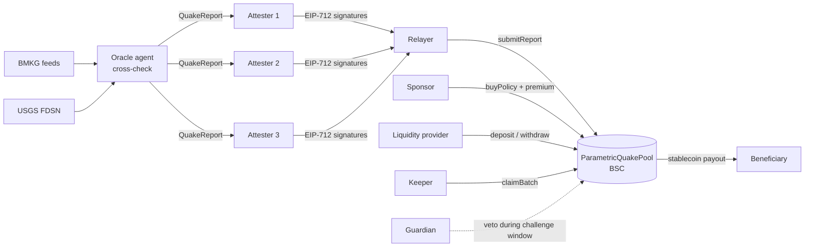
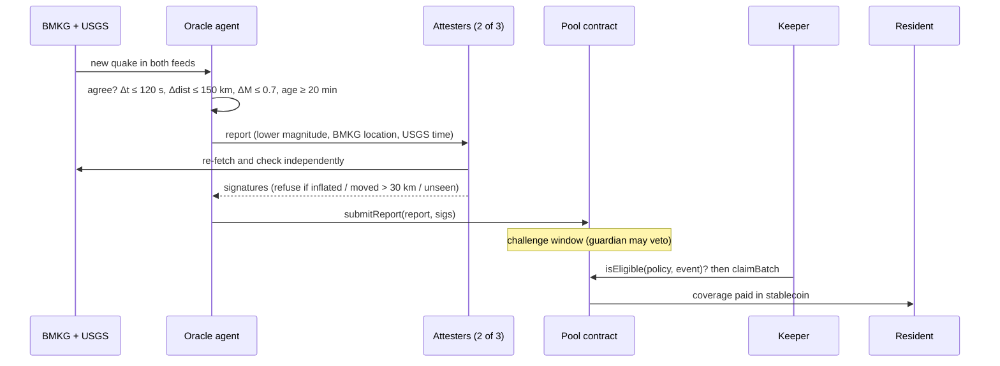

<p align="center"></p>

# ARKUS: Parametric Earthquake Insurance on BNB Chain

**English** · [Bahasa Indonesia](README.id.md)

[](../../actions/workflows/test.yml)
**Live demo: [arkuss.app](https://arkuss.app)** · BNB Smart Chain Testnet · Track: Finance & Commerce

> When BMKG **and** USGS both confirm an earthquake above a policy's threshold inside its radius, the pool pays the beneficiary automatically. No claim forms, no damage survey, no waiting months.

Hackathon prototype. Not audited, not a licensed insurance product.

## The problem

Indonesia sits on the Ring of Fire and has a damaging earthquake almost every year (Padang 2009, Lombok 2018, Palu 2018, Cianjur 2022). Most households are uninsured. For those who are, traditional indemnity insurance pays only after damage surveys and paperwork, often months later, when the cash is most urgently needed in the first days.

## The solution

**Parametric insurance**: the payout is triggered by a measurable event (magnitude + distance), not by assessing losses.

- **Sponsors** (local government, CSR programs, diaspora, NGOs) buy policies **for** residents. Beneficiaries only need an address: no wallet app, no gas, no claim.
- **Liquidity providers** fund a fully-collateralised pool and earn the premiums.
- An **oracle agent** watches BMKG (Indonesia's agency) and USGS. A quake is reported only when **both agencies agree**, using the more conservative numbers.
- **2-of-3 attesters** sign each report independently (EIP-712). Each attester re-fetches the data itself and refuses to sign anything it cannot confirm.
- The **smart contract** decides who gets paid with deterministic on-chain rules, after a guardian challenge window.

## Architecture





## How it works

| Step | Where | Rule |
|---|---|---|
| Fetch | `agent/sources.js` | BMKG `autogempa`, `gempaterkini`, `gempadirasakan` + USGS FDSN (Indonesia box ±3°, 7 days) |
| Cross-check | `agent/match.js` | both agencies must agree: Δtime ≤ 120 s, Δdistance ≤ 150 km, Δmagnitude ≤ 0.7, event ≥ 20 min old |
| Conservative report | `agent/match.js` | magnitude = the **lower** of the two, location = BMKG, time = USGS, `eventId = keccak("USGS:"+id)`, `sourcesHash` = hash of both raw snapshots |
| Independent attestation | `agent/match.js` | each attester refuses if magnitude was raised, epicentre moved > 30 km, or it cannot see the quake |
| Submission | `agent/chain.js` | any relayer submits; the contract checks N-of-M signatures, report age ≤ 7 days, one report per `eventId` |
| Payout | `agent/chain.js` | stateless keeper reads `PolicyBought` + `ReportSubmitted` logs, filters off-chain, confirms `isEligible()` on-chain, calls `claimBatch()` |

### Contract safety design (`contracts/ParametricQuakePool.sol`)

- **Fully collateralised**: total coverage reserved never exceeds pool assets, so there is no insolvency or pro-rata logic.
- **Waiting period** after purchase (anti adverse selection), configurable per pool.
- **Challenge window**: the guardian can veto a report before claims open.
- **No double payout**: one report per `eventId`, one payout per policy.
- **LP withdrawals are frozen** from an accepted report until its claim window ends, so LPs cannot exit at the pre-loss share price.
- **Settlement grace (14 days)** covers report age + challenge + claim window, so a quake on a policy's last day is still paid before the collateral is released.
- **Simulated reports** (historical replays for the demo) only work on pools deployed with `allowSimulated = true`.
- Coordinates restricted to Indonesia's bounding box, on-chain distance check with integer maths.

## Deployed contracts (BSC Testnet, chainId 97)

| Contract | Address |
|---|---|
| ParametricQuakePool | [`0x5f9Cf5136DEc36B0e8f1303d42E936fE65190d0F`](https://testnet.bscscan.com/address/0x5f9Cf5136DEc36B0e8f1303d42E936fE65190d0F) |
| MockUSDT (test stablecoin) | [`0x0EAf353F1aD0413DE01132a2DF16f73cc0963E6b`](https://testnet.bscscan.com/address/0x0EAf353F1aD0413DE01132a2DF16f73cc0963E6b) |

Demo pool: 2-of-3 attesters, 180 s challenge window, simulated replays enabled. Full details in [`deployments/bsc-testnet.json`](deployments/bsc-testnet.json).

Example run: replay of the 2009 Padang M7.6 earthquake, [report tx](https://testnet.bscscan.com/tx/0xb9c80594fb9342acf2804700435d6395c06ba1df63abc8f027d6b7c00a0e0032) → [payout tx](https://testnet.bscscan.com/tx/0xc1a721d21e1b38e96a3fee2d6b37289b57ad96975011717979416e746f05a871). Padang, Pariaman and Painan were paid 2,750 mUSDT in total; Bukittinggi and Mentawai (just outside their radius) and Palu (other island) were not.

## Try the demo

1. Open [arkuss.app](https://arkuss.app): map of active policies, real quakes reported by the oracle, pool balances.
2. Click **Simulasikan gempa M7.6**: the oracle replays Padang 2009, attesters sign, the report goes on-chain, the challenge window counts down, and the keeper pays the eligible residents. Every step links to BscScan.

## Run locally

Requires Node.js ≥ 18.

```bash
npm install
npm test                 # compile + 25 contract tests + 11 agent tests (local chain, no keys needed)
npm run agent:dry        # live BMKG + USGS cross-check, shows what WOULD be reported
```

With a deployed pool (`cp .env.example .env`, then fill it or run `npm run deploy`):

```bash
npm start                # one process: oracle loop + dashboard on http://127.0.0.1:3000
npm run agent:replay     # demo replay of Padang 2009 (pool must allow simulated reports)
npm run agent:keeper     # pay every eligible policy
npm run verify           # BscScan verification files (+ API submit if BSCSCAN_API_KEY is set)
```

`scripts/deploy.js` is idempotent: it generates the relayer and attester keys into `.env` (never printed), waits for tBNB, deploys both contracts, seeds LP liquidity and demo policies. `deploy/install.sh` installs everything on an Ubuntu VPS (Node 20, Caddy or nginx with HTTPS, systemd).

## Repository layout

```
contracts/ParametricQuakePool.sol  pool, policies, EIP-712 N-of-M oracle reports, claims
contracts/MockUSDT.sol             testnet stablecoin with faucet
compile.js / test.js               compiler + 25 contract tests
agent/                             oracle agent: sources, cross-check, signing, keeper, CLI, 11 tests
scripts/                           deploy, demo policies, BscScan verification
server/index.js                    single process: oracle loop + public dashboard + JSON API + replay
web/index.html                     dashboard (Leaflet map, no build step)
deploy/                            VPS installer + Windows upload helper
deployments/bsc-testnet.json       live contract addresses
```

## Known limitations (and the production path)

- The owner can change attesters and threshold instantly. Production: owner = multisig + timelock.
- The demo runs all attester keys in one process. Production: each attester is a separate institution and server (e.g. university, BPBD, insurer).
- Premiums use a placeholder rate table (`ratePerYearBps`), not actuarial pricing.
- If no keeper runs for more than 14 days after a policy ends, an eligible policy could be released unpaid. Anyone can run the keeper.
- Beneficiaries still need an address (a custodial or embedded wallet can be created by the frontend).
- Payout uses a test stablecoin; production would use a real stablecoin on BSC.

## License

[MIT](LICENSE)
